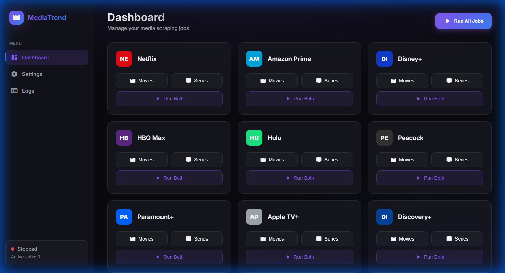
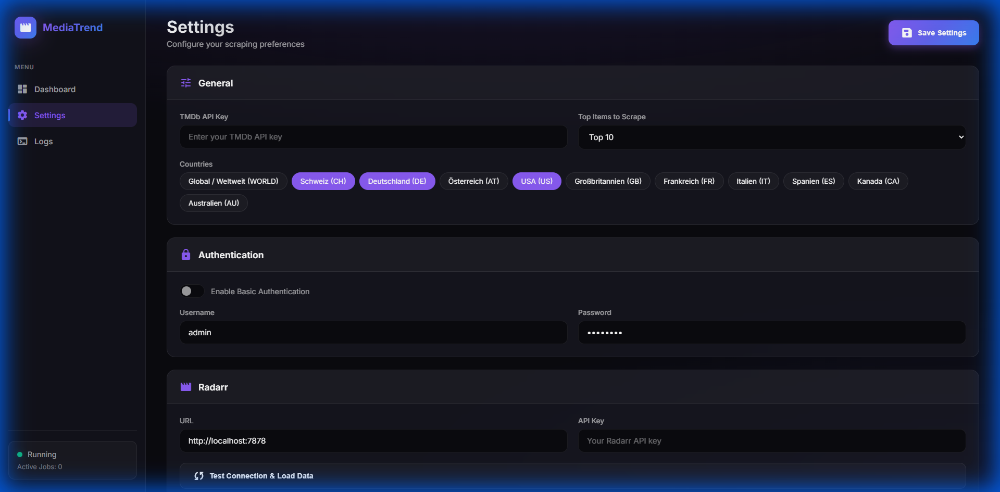

<p align="center">
  
</p>

<h1 align="center">MediaTrend Scraper</h1>

<p align="center">
  <strong>Automatically add trending movies and series to your Radarr & Sonarr library</strong>
</p>

<p align="center">
  <a href="#features">Features</a> •
  <a href="#screenshots">Screenshots</a> •
  <a href="#installation">Installation</a> •
  <a href="#configuration">Configuration</a> •
  <a href="#supported-platforms">Platforms</a>
</p>

---

## ✨ Features

| Feature                            | Description                                           |
| ---------------------------------- | ----------------------------------------------------- |
| 🎬 **Multi-Platform Scraping**     | Scrapes Top 10 lists from 18+ streaming services      |
| 🎯 **Radarr & Sonarr Integration** | Automatically adds movies and series to your library  |
| 🌐 **Modern Web Interface**        | Beautiful dark-mode dashboard with real-time logs     |
| ⏰ **Scheduler**                   | Set custom schedules for each platform and media type |
| 🔢 **Configurable Top Count**      | Choose Top 3, 5, or 10 titles to scrape               |
| 🔒 **Authentication**              | Secure your instance with basic authentication        |
| 🐳 **Docker Support**              | One-command deployment with Docker Compose            |

---

## 📸 Screenshots

### Dashboard

The modern dashboard provides quick access to all streaming platforms with one-click scraping.



### Settings

Configure your TMDb API key, Radarr/Sonarr connections, countries, and scheduling preferences.



---

## 🚀 Installation

### Option 1: Docker Hub (Recommended)

```bash
# Pull and run with Docker
docker run -d \
  --name mediatrend-scraper \
  -p 9000:9000 \
  -v ./settings.json:/app/settings.json \
  --restart unless-stopped \
  jokeriscrazy/mediatrend-scraper:latest
```

Or use Docker Compose:

```bash
# Create a docker-compose.yml or download from repo
curl -O https://raw.githubusercontent.com/jokeriscrazy/MediaTrend-Scraper/main/docker-compose.yml

# Start the container
docker-compose up -d
```

The web interface will be available at `http://localhost:9000`

### Option 2: Build from Source

```bash
# Clone the repository
git clone https://github.com/jokeriscrazy/MediaTrend-Scraper.git
cd MediaTrend-Scraper

# Build and start with Docker Compose
docker-compose up -d --build
```

### Option 3: Manual Installation

**Prerequisites:**

- Python 3.11+
- Google Chrome (for Selenium scraping)

```bash
# Install dependencies
pip install -r requirements.txt

# Start the web server
python main.py

# Or use CLI mode
python main.py --cli
```

---

## ⚙️ Configuration

All settings can be configured via the web interface at `http://localhost:9000`.

### Required Settings

| Setting                  | Description                                                                                        |
| ------------------------ | -------------------------------------------------------------------------------------------------- |
| **TMDb API Key**         | Required for matching titles. Get one at [themoviedb.org](https://www.themoviedb.org/settings/api) |
| **Radarr URL & API Key** | Your Radarr instance (e.g., `http://localhost:7878`)                                               |
| **Sonarr URL & API Key** | Your Sonarr instance (e.g., `http://localhost:8989`)                                               |

### Optional Settings

| Setting            | Default    | Description                                      |
| ------------------ | ---------- | ------------------------------------------------ |
| **Top Count**      | 10         | Number of top titles to scrape (3, 5, or 10)     |
| **Countries**      | DE, US, CH | Countries to scrape top lists from               |
| **Search on Add**  | Enabled    | Automatically search for downloads when adding   |
| **Authentication** | Disabled   | Protect the web interface with username/password |

---

## 🌍 Supported Platforms

<table>
<tr>
<td>

**Global Streaming**

- Netflix
- Amazon Prime
- Disney+
- HBO Max
- Apple TV+
- Paramount+

</td>
<td>

**Regional Streaming**

- Hulu (US)
- Peacock (US)
- BBC iPlayer (UK)
- Joyn (DE)
- RTL+ (DE)
- Sky (EU)

</td>
<td>

**Specialized**

- Crunchyroll
- Discovery+
- Star+
- Rakuten TV
- Google Play
- Canal+

</td>
</tr>
</table>

---

## 📁 Project Structure

```
MediaTrend-Scraper/
├── main.py           # Entry point
├── worker.py         # Scraping logic
├── scheduler.py      # Job scheduling
├── settings.py       # Configuration management
├── sources/          # Scraping modules
│   ├── netflix.py
│   └── flixpatrol.py
├── targets/          # Media server integrations
│   ├── radarr.py
│   └── sonarr.py
├── web/              # Web interface
│   ├── app.py
│   └── templates/
└── docs/             # Documentation assets
```

---

## 🤝 Contributing

Contributions are welcome! Please feel free to submit a Pull Request.

---

## 📄 License

This project is licensed under the [MIT License](LICENSE).

---

<p align="center">
  Made with ❤️ for media enthusiasts
</p>
