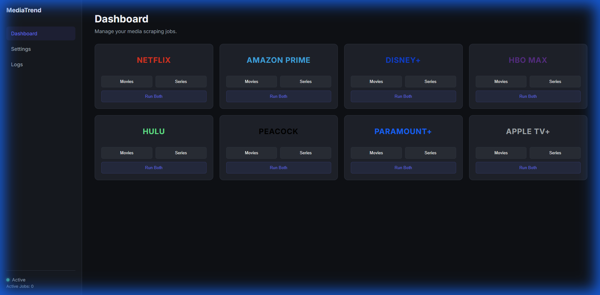
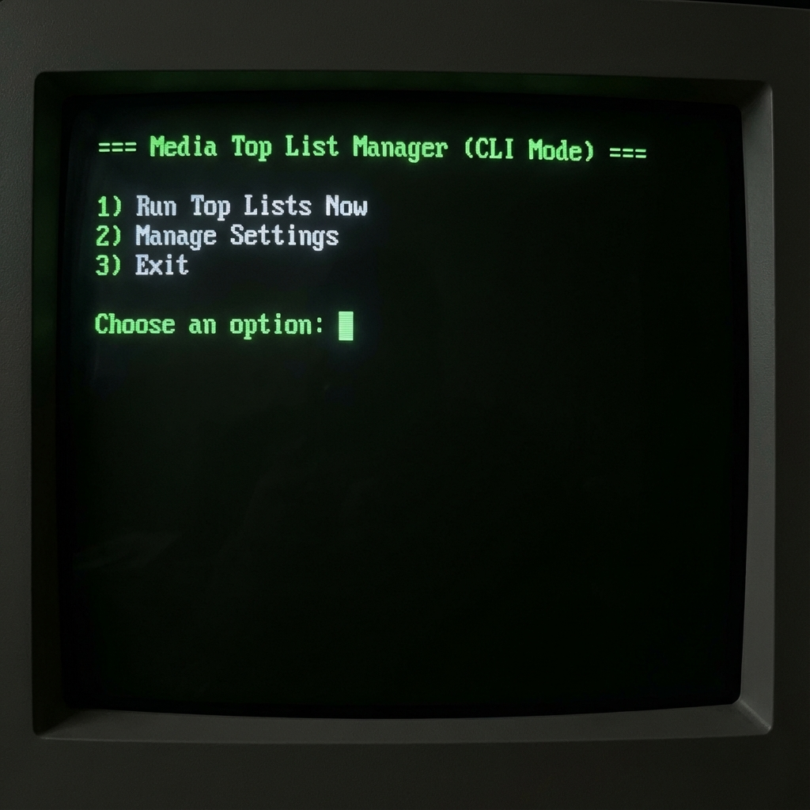

# MediaTrend Scraper

A powerful tool to scrape Top 10 lists from various streaming services (Netflix, Disney+, Amazon Prime, etc.) and automatically add these media items to Radarr and Sonarr.

## Features

- **Multi-Source Scraping**: Scrapes Top 10 lists from a wide range of streaming services via Netflix API and FlixPatrol:
  - **Global Players**: Netflix, Amazon Prime, Disney+, HBO Max, Hulu, Peacock, Paramount+, Apple TV+
  - **Specialized**: Discovery+, Star+, Rakuten TV, Google Play, Crunchyroll
  - **European/Regional**: BBC iPlayer, Joyn, RTL+, Sky, Canal+
- **Radarr & Sonarr Integration**: Automatically adds found movies and series to your media library.
- **Web Interface**: Modern dashboard to manage settings, view logs, and trigger manual runs.
- **CLI Mode**: Interactive command-line interface for quick tasks.
- **Scheduler**: Granular scheduling for each platform and media type (Movies/Series).
- **Docker Support**: Easy deployment using Docker and Docker Compose.

## Web Interface

The web interface provides a modern dashboard to manage your settings, view logs, and trigger manual runs.



## CLI Mode

For users who prefer the terminal, the application offers an interactive CLI mode.

**Usage:**

```bash
python main.py --cli
```

**Example Output:**


## Installation & Usage

### Option 1: Docker (Recommended)

The easiest way to run the scraper is using Docker.

1.  **Prerequisites**: Ensure Docker and Docker Compose are installed.
2.  **Configuration**:
    - The `settings.json` file is automatically mounted in the container. You can edit this file locally to adjust your API keys and settings.
    - Ensure the `settings.json` file is in the same directory as `docker-compose.yml`.
3.  **Start**:
    Open a terminal in the project folder and run the following command:
    ```bash
    docker-compose up -d --build
    ```
4.  **Access**:
    The web interface is now accessible at `http://localhost:9000`.

### Option 2: Local Installation (Python)

1.  **Prerequisites**: Python 3.11 or higher and Google Chrome (for Selenium).
2.  **Install Dependencies**:
    ```bash
    pip install -r requirements.txt
    ```
3.  **Start Web Interface**:

    ```bash
    python main.py
    ```

    Access at `http://localhost:9000`.

4.  **Start CLI Mode**:
    ```bash
    python main.py --cli
    ```

## Configuration

Configuration is done via the `settings.json` file or conveniently via the web interface.

### Important Settings:

- **Radarr/Sonarr**: URL and API Key are required to add media.
- **Sources**: Enable/Disable individual sources (e.g., Netflix, Disney+).
- **Countries**: Define for which countries lists should be fetched.
  - **Supported Regions**: Global, USA, UK, DACH (DE, AT, CH), France, Italy, Spain, Canada, Australia.
- **Authentication**: Secure the web interface with a username and password.

### Scheduler

The scheduler allows you to define specific times for each job.

- **Granularity**: Separate schedules for Movies and Series for each platform.
- **Default**: Jobs are disabled by default and need to be enabled in the settings.

### Authentication

Basic Authentication can be enabled to protect the web interface.

- **Default Username**: `admin`
- **Default Password**: `password`
- **Enable**: Go to Settings -> Authentication and check "Enable Basic Authentication".
- **Note**: You must restart the application for authentication changes to take effect.

## Development

- `main.py`: Entry point of the application. Starts web server and scheduler.
- `worker.py`: Contains the logic for processing scraping jobs.
- `sources/`: Modules for the various data sources.
- `targets/`: Modules for the target systems (Radarr, Sonarr).

## License

[MIT License](LICENSE)
